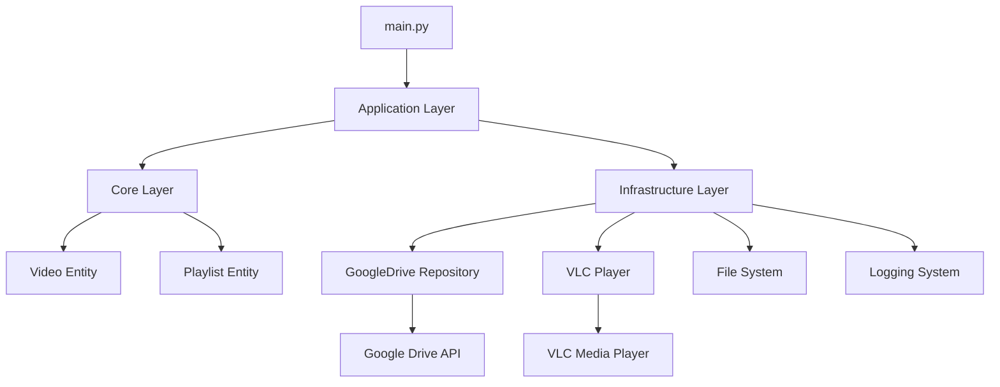
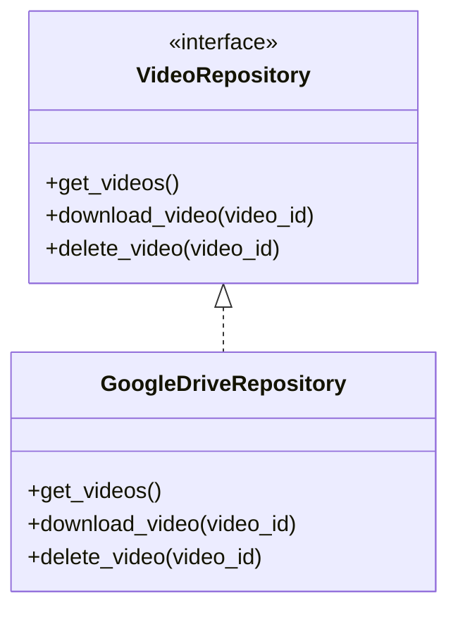
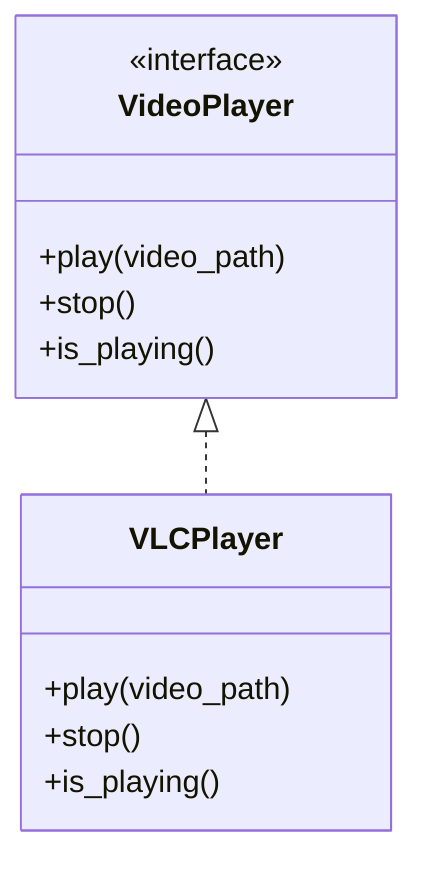

# Arquitectura del Sistema

## Principios Arquitectónicos

### Arquitectura Hexagonal Simple

El sistema sigue una arquitectura hexagonal (puertos y adaptadores) pero simplificada, enfocada en la separación clara de responsabilidades:

- **Dominio (Core)**: Entidades de negocio puras
- **Casos de Uso (Application)**: Orquestación de operaciones
- **Infraestructura**: Adaptadores externos

### Separación de Responsabilidades

Cada capa tiene responsabilidades específicas:

#### Core (Dominio)
- Entidades de negocio
- Reglas de negocio puras
- Interfaces que definen contratos

#### Application (Casos de Uso)
- Orquestación de operaciones
- Coordinación entre infraestructura y dominio
- Lógica de aplicación

#### Infrastructure (Adaptadores)
- Comunicación con servicios externos
- Adaptadores de tecnología específica
- Implementaciones concretas

## Diagrama de Arquitectura

## Flujo de Datos

### Sincronización de Videos
1. **Application Layer** inicia sincronización en background
2. **GoogleDrive Repository** consulta cambios en Google Drive
3. **File System** actualiza caché local
4. **Video Entity** representa videos en dominio

### Reproducción de Videos
1. **Application Layer** solicita siguiente video
2. **Playlist Entity** determina orden de reproducción
3. **VLC Player** reproduce video en pantalla
4. **Logging System** registra evento

## Patrón de Diseño: Repository

## Patrón de Diseño: Adapter

## Manejo de Errores

### Estrategia de Resiliencia
- **Reintento automático** para fallos de red
- **Degradación graceful** cuando servicios externos fallan
- **Logging detallado** para auditoría y debugging
- **Recuperación automática** de threads caídos

### Niveles de Error
1. **Crítico**: Detiene reproducción, requiere intervención
2. **Advertencia**: Problema solucionable automáticamente
3. **Info**: Evento normal del sistema

## Concurrencia

### Threading Strategy
- **Main Thread**: Control de reproducción principal
- **Sync Thread**: Sincronización con Google Drive
- **Logger Thread**: Escritura de logs en background

### Comunicación Inter-Threads
- **Queue-based** para comunicación segura
- **Event-driven** para coordinación
- **Shared state** mínimo para evitar race conditions